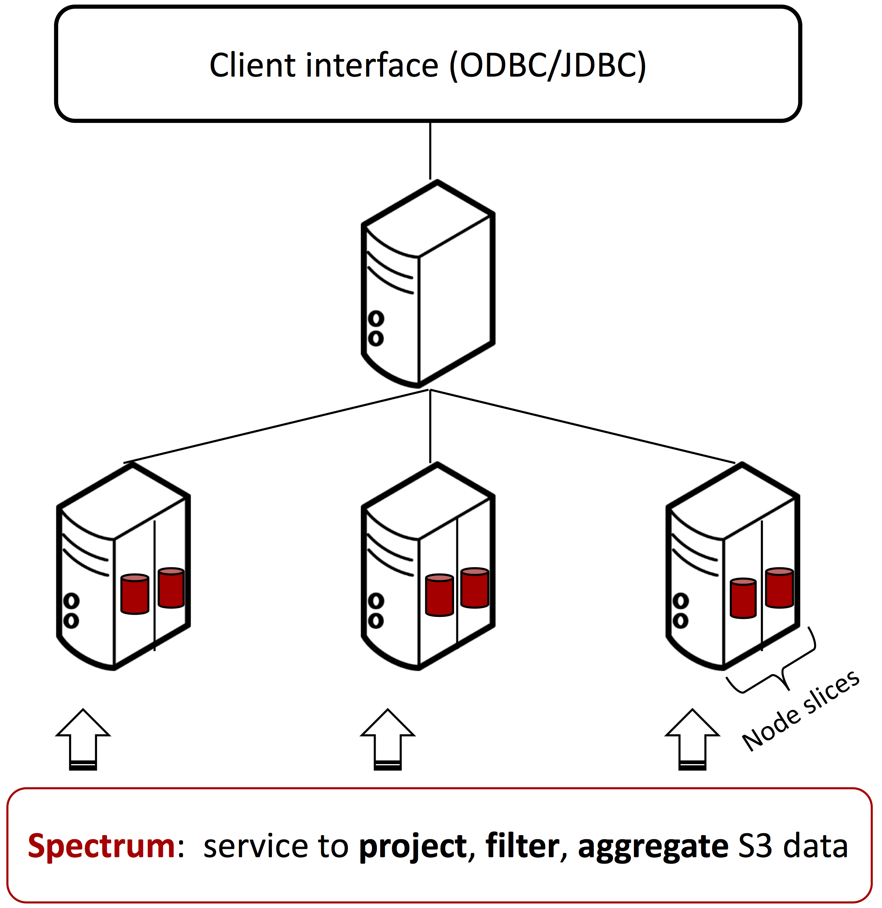
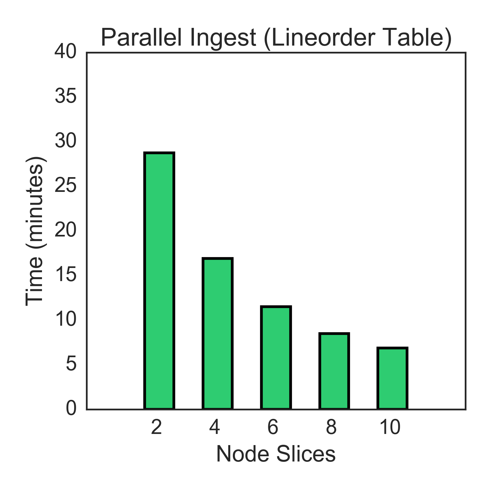
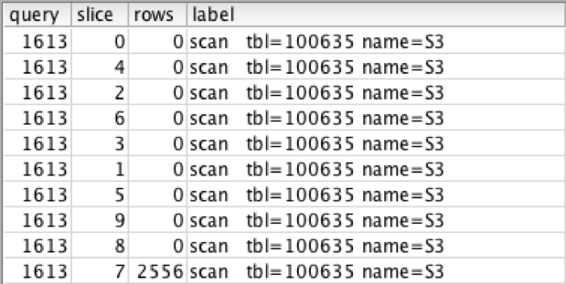
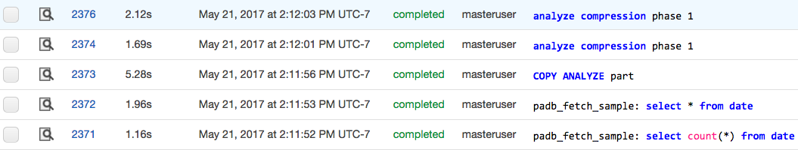
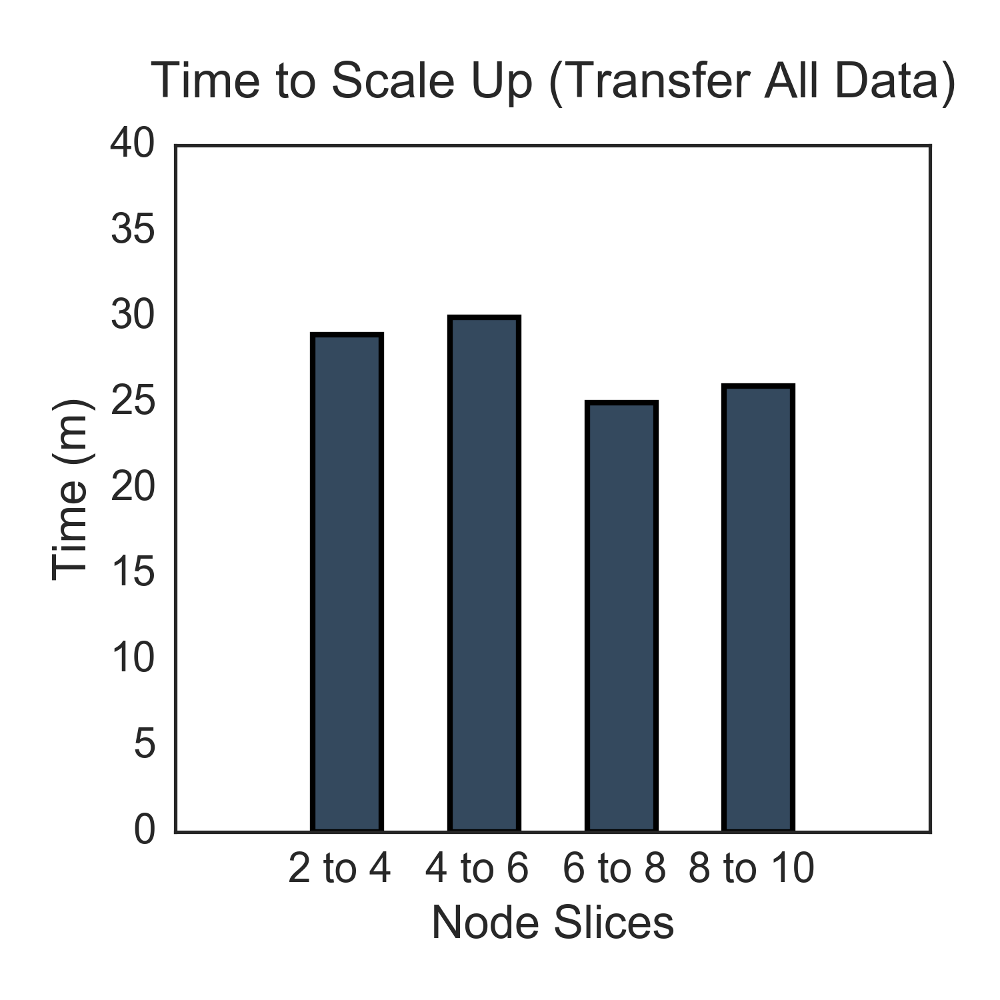
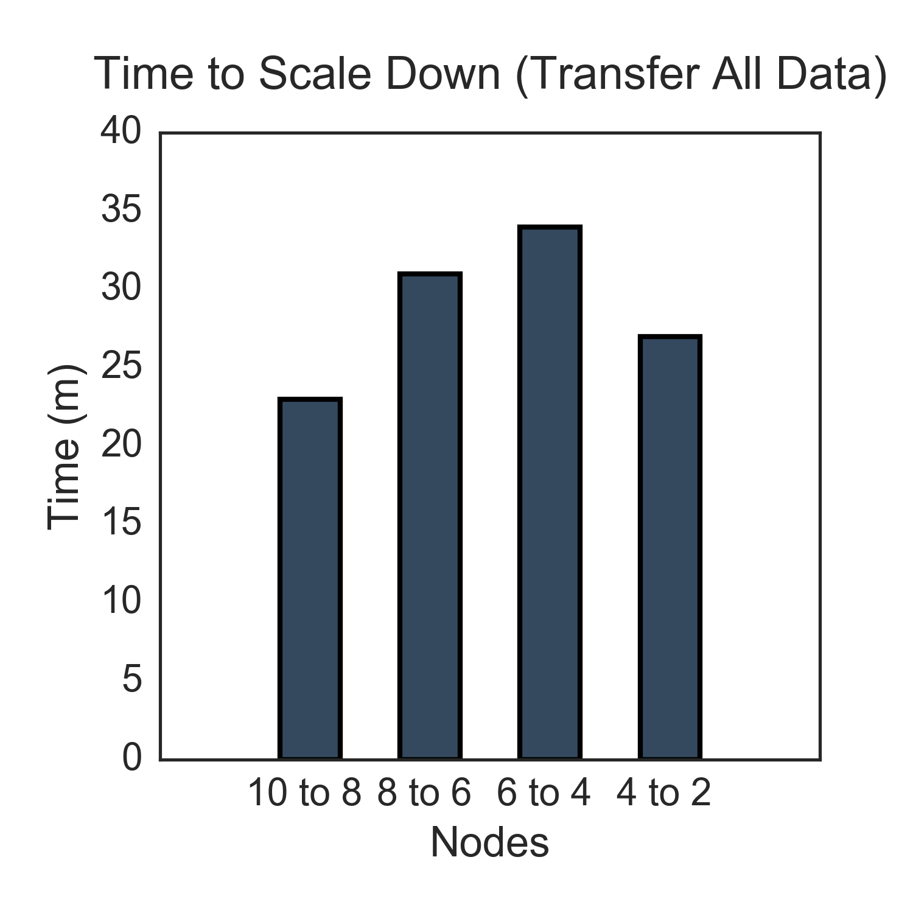
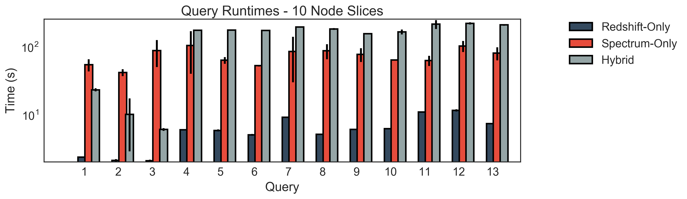
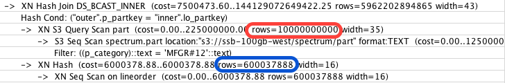
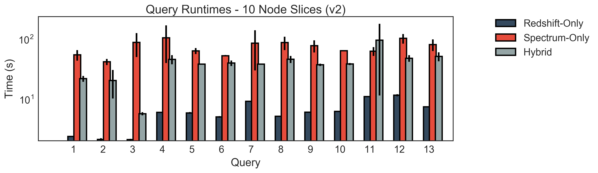

# Loading, Scaling, and Query Processing on Amazon Redshift and Amazon Spectrum  

Amazon Redshift, a service that began back in 2013, is a fairly new database warehouse service that supports storing and managing structured data. Internally, the service stores the data in a columnar format to facilitate data compression. The system's features are primarily like any other RDBMS, supporting the ability to run transactions and high-performance analysis on large datasets. In fact, it supports many Postgres features (from version 8.0.2), but then branched off to support other new features including the ability to define table distribution functions and the ability to ingest data directly from S3.

More recently, Amazon released a new service called Amazon Redshift Spectrum. Spectrum can read and process data directly from S3, without having to store the data directly on a Redshift cluster. This enables users to run queries that span across different storage backends. For example, a user can read data from S3 and process it along with data stored in Redshift. 

Reading data from S3 provides an interesting benefit in place of scaling. If I/O is the main bottleneck for a workload, Spectrum can take care of pre-processing S3 data in parallel before sending the data directly to Redshift's compute nodes. We evaluate the query performance for these types of queries in Section 4. 

In this project, we focus on three main components. First, we consider the time it takes to load data into the system. We describe how to create relations and the pre-processing steps required. Second, we consider the amount of time it takes for Redshift to scale the cluster by adding or removing nodes. Third, we run queries that access relations from different backends, including Redshift, Spectrum or a combination of both which we call *hybrid* queries.  

## Section 1. The Redshift Architecture
To maximize the performance of a provisioned cluster, it is important to understand the system architecture. As a user, you will spend most of the time sending commands to to the leader node through a standard JDBC/ODBC client. The leader node parses queries and sends execution plans to the workers. Workers are only selected to run a query if they contain a portion of the data being read. Leader nodes are also responsible for managing the catalog.

<br>
<center>
<figure>

<figcaption>Figure 1: Redshift Architecture</figcaption>
</figure>  
</center>
<br>

Each compute node is partitioned by node slices which have access to a portion of the node's memory and disk space. The number of slices available on the node is dependent on the type of instance selected. For example, the cheapest instance available has two slices for each node. When the leader node issues a query execution plan, it will issue commands to each individual node slice, not per physical machine.

In Figure 1, we illustrate an example of a Redshift cluster with a leader node and a set of compute nodes. Each compute node contains 2 slices, and through Amazon Spectrum, compute nodes are able to access data that lives directly in S3. For this project, we treat Spectrum as a black box service. Based on their documentation, Spectrum is a service that *applies sophisticated query optimization, scaling processing across thousands of nodes*. Unfortunately, the details of how data is processed on their service is not provided to users.


## Section 2: Experimental Setup 

When starting up a cluster for the first time, the user must specify whether they're interested in running a single-node or multi-node deployment. There are extra steps involved in the setup, including installing the recommended client and opening the leader node's port to allow external connections. Overall, it was simple to get started, as all steps in the setup process are well documented.

For the dataset, we use the TPC-H SSB dataset on SF=100. On Redshift, we did not have many options available when selecting between the different instance types. The cheapest ones are dc1.large at $.25/hour and spot instances are not available for this service. This instance type includes 2 cores, 15 GB memory and 160GB of SSD storage. For all the experiments, we scaled the cluster from 1 node up to 5 nodes (10 node slices).

## Section 3. Loading Data

The process of loading data only applies to Redshift, not the Spectrum service. For Spectrum, the only information required is providing metadata about the table. The metadata should specify the schema, file delimiter and the location of the data in S3. After registering the table, the data is ready for queries.

For Redshift, there are many more steps. Before loading data into the Redshift cluster, users should should first declare a schema for each table. Redshift supports many standard datatypes. Overall, the `CREATE TABLE` command is really similar to other database systems except that the user is given an option to specify a distribution key. During data ingest, Redshift will reshuffle the data and store it according to this key. Available options for this key include: `EVEN`, `KEY` and `ALL`. Where `EVEN` represents a round-robin partitioning, `KEY` represents hashing by a specific column (multi-key hashing is not supported), and `ALL` represents a broadcast.  Given our data, we partitioned the lineorder relation (the largest table) based on a distribution key, while all the other smaller dimension tables are broadcast across the cluster. 

Before ingesting the data, we make sure to split the data in S3 into many small chunks. The number of chunks does not need to match the number of node slices available, as Redshift handles the mapping between chunks and node slices. Also, when generating the chunks, we need to make sure to split the file based on lines, and not bytes. Otherwise, we end up having chunks with partial rows. 

Once the pre-processing is finished, we can load the data with the following command, where the S3 path points to the chunks:

```
copy lineorder from 's3://path/to/data/chunks/lineorder' 
iam_role '' 
delimiter '|' region 'us-west-2';
```

In Figure 2, we show the amount of time it takes to load the Lineorder relation for different number of node slices. As expected, there is a large performance difference between using 2 and 4 node slices (as we're doubling the amount of slices).

<br>
<center>
<figure>

<figcaption>Figure 2: Parallel ingest for the Lineorder Relation</figcaption>
</figure>
</center>
<br>

For the rest of the dimension tables, the ingest time is much shorter, where runtimes ranged in the span of seconds. Although the ingest times are fast, we still took a closer look at the query plan for loading these smaller dimension tables. It was interesting to see that although we specified that these tables should be broadcast, Redshift only assigns one node slice to read the file from S3 before broadcasting to all the workers. An alternative query plan would be to have each worker independently read the broadcast table directly from S3 instead of having one slice reading and shuffling/broadcasting it to all the other workers. In Figure 3, we show the scan portion of this query plan. Notice how only one slice (node slice 7) is reading the table. The rest of the query plan (not shown) details how this slice broadcasts the data to the rest of the slices.

<br>
<center>
<figure>

<figcaption>Figure 3: Query plan for ingesting dimension table </figcaption>
</figure>
</center>
<br>

After ingest, Redshift will automatically try to find the best encoding for each column. If a user prefers to keep data in the RAW format, they can specify this in the COPY command during ingest. Redshift can support up to 8 different types of compression encodings. In Figure 4, we show an example of the automatic compression commands in the log (first 3 entries).

Encoding is important, as it affects the amount of data being transferred during scaling, which we discuss in the next section.  


<br>
<center>
<figure>

<figcaption>Figure 4: Automated compression commands</figcaption>
</figure>
</center>
<br>


## Section 3. Scaling up and down

Redshift also offers the ability to scale the cluster up or down, or even scale to a different instance type. The only requirement is that the data should be able to fit in the new configuration. 

When deciding to resize, which only requires a couple clicks on the dashboard, Amazon Redshift immediately launches a new cluster at the new requested size. The data from the old cluster is then moved over to the new one. During this time, the old cluster is in a *read-only* mode, meaning that transactions or ingest queries (any writes) are not allowed. Once all the data has finished transferring, all client connections point to the new cluster.

When a user initially sends a resize request, it takes approximately 10 minutes to create a new cluster. This seems long, as starting up a new cluster from scratch only takes about half the time. After the new cluster is provisioned, the data transfer begins. After ~20 minutes (based on our dataset), the cluster finishes resizing.     

In Figure 5, we have two graphs showing the runtimes of the resize step. On the left graph, we display the time it takes to scale up by one node at a time. On the x-axis, we show the number of slices we scale from and the number of slices we scale to. For example, for the first bar, we started from a 2-node-slice cluster and scaled up to a 4-node-slice cluster. Each time we switched to a different target cluster, we kept migrating the same amount of data. From this graph, it does seem like having more node slices as readers and writers (see 6-to-8 and 8-to-10) is slightly faster than 2-to-4 and 4-to-6. Note, we did try to look at the documentation to see if there was any more information available on how this data transfer actually happens (for example, is there a coordinator bottleneck?). Currently, there does not seem to be any documentation that details this step. In addition, we cannot view the cluster resource utilization during this step. 

On the right figure, we do not see the same trend. It was surprising to see that switching from 4-to-2 node slices turned out to be faster than some of the other scale-down migrations. In general, since we do not know how the transfer happens internally, it's not clear if there is a trend we should look out for or if these runtime variances are due to other factors of the system.  

<br>
<center>
<figure>
  
<figcaption>Figure 5: Time to scale up or down</figcaption>
</figure>
</center>
<br>

### Section 4. Query Processing

For the final part of this project, we also benchmark the runtimes for queries specified in the TPC-H SSB [paper](http://www.cs.umb.edu/~poneil/StarSchemaB.PDF). There are a total of 13 queries, inspired by the original TPC-H queries.  

Our goal was to try three variants of these queries. One variant would consider the case where all tables scanned are located on Redshift (Redshift Only). The second variant assumes that all tables are only on S3 (Spectrum Only). Last, we consider the case where some tables are read from Redshift and others are read from S3 (Hybrid). 

For Hybrid queries, we had the Lineorder relation read from Redshift and all other dimension tables read from S3. The reasoning for this was to minimize the amount of data being read from S3. 

Recall, when we initially ingested data for Redshift, we specified the distribution style for each relation. In addition, since the data on Redshift is also compressed, this gives Redshift-Only queries a large advantage. Between Spectrum-Only and Hybrid queries, it would seem that Hybrid queries should perform slightly better -- as a subset of the relations are read from Redshift. As we see in the next figure, this is not the case (at least not initially). 

In Figure 6, we show the runtimes for the queries on all variants for 10 node slices. Note, the y-axis is in log scale, as Redshift-Only queries are quite fast. We ran each query variant 4 times, omitted the first cold run, and plotted the average as well as the standard deviation for the rest of the runs.  There are a couple things we noticed. One, there is high variance in performance for Spectrum-Only queries. This might be due to either S3 or the Spectrum service, but this is not clear. Second, there are high latencies for the hybrid queries. 

<br>
<center>
<figure>

<figcaption>Figure 6: Query Runtimes for all Storage Variants (log-scale) </figcaption>
</figure>
</center>
<br>

We took a closer look at the query plans for the bad hybrid queries, starting with Q4. When looking at the query plan, we noticed that the query optimizer was not assigning costs as we would expect. In Figure 7, we see a portion of this query plan. It turns out that any table scanned from S3 is assigned a very high estimated row count : 10 billion rows (see the red shape on the figure). As a result, the optimizer sees Lineorder as the smallest table, and decides to broadcast this table before joining it with the others. These costs cause the queries to slowdown considerably.

We also tried to see whether there was a way for Spectrum to learn statistics about data in S3. Although S3 does not provide any information with respect to the number of rows or schema, it could be useful to retrieve the size of the relation in bytes. Perhaps this was not done because retrieving an object's metadata takes too long for the query optimizer. 

<br>
<center>
<figure>

<figcaption>Figure 7: Query Runtimes for all Storage Variants</figcaption>
</figure>
</center>
<br>

We took the hybrid queries and updated them to do the following: read Lineorder from Redshift and read the dimension tables from S3. In the Figure 9, we show the runtime for the new version of the Hybrid queries (v2). In general, the runtimes improve now that the Lineorder relation is no longer being broadcast to all the nodes. Although, in some cases, we sometimes still see a large variance, as seen in query 11. 

<br>
<center>
<figure>

<figcaption>Figure 9: Query Runtimes for all Storage Variants (Hybrid Version 2)</figcaption>
</figure>
</center>
<br>


## Section 5. Conclusion
In conclusion, in this work we demonstrated data loading, scaling and query processing in Redshift as well as the new Spectrum service. This work is preliminary, and there are still many optimizations that could be done to improve the performance. For example, if the data is stored in S3 in a Parquet format, this would improve performance as Spectrum will only read the necessary columns for each query. Second, other optimizations for Redshift include the ability to create indexes or running statistics on the relations.

##### Acknowledgements: Special thanks to the UW HPCC club for providing AWS credits for this project. 