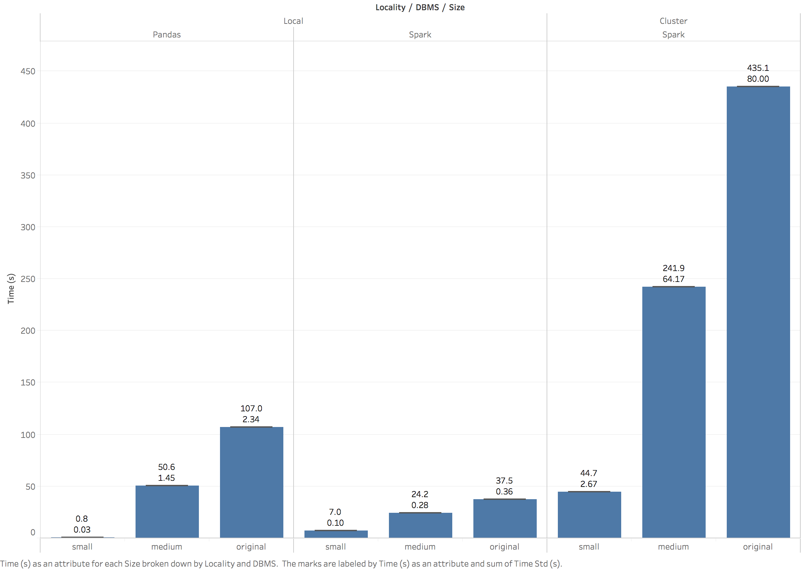
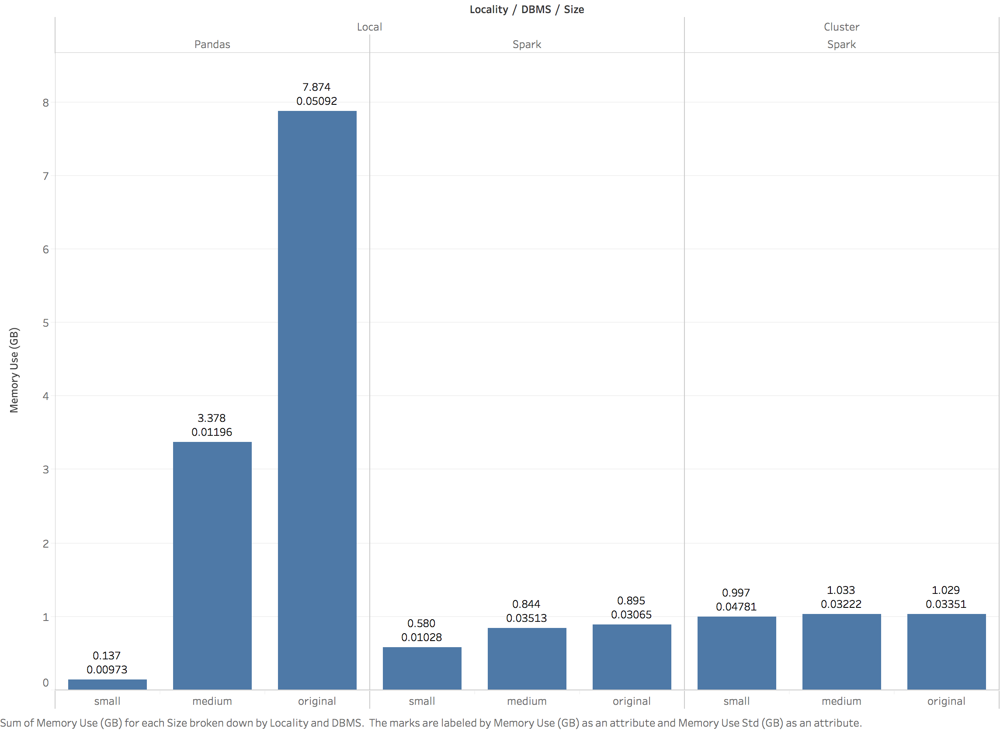

# To Spark or Not to Spark? 
> Heuristics for choosing to use Spark for Researchers.

by [Tony Cannistra](http://anthonycannistra.com)

The beginning of a new research project is often an exciting time, filled with interesting questions to answer or new methods to try. Frequently researchers find themselves itching to get some preliminary results, or to explore the space of possible questions to answer with a new dataset. As a result, the implementation for a given data-driven analysis can be chosen hastily, which can lead to poor performance and low productivity for that researcher. 

Many researchers rely on flatfiles and the DataFrame abstractions in Python and R to perform their analyses, but suffer when the size of the data reaches a certain threshold. Fortunately, there are more powerful data management options out there for researchers, but often they are ignored in favor of slower methods which are familiar to the researcher. One of these more powerful tools is called Spark, described below. It provides a distributed data processing framework with an API that is often familiar to researchers who are accustomed to the DataFrame abstractions in their native languages, which is another element of its appeal. 

In this article, I evaluate the tradeoffs between using the native Python/R data management frameworks like DataFrames and deploying the parallel in-memory data management system Apache Spark. Specifically I attempt to develop a data size-based "rule of thumb" to help researchers decide whether the investment in configuring and deploying Spark is worth any improvement in runtime that may be achieved. I hope to help answer the question, "Do I have enough data to use Spark? Will it make my analysis faster and more usable?" I evaluate Python's DataFrame abstraction against Spark run locally and on a 10-node cluster provided by Amazon Web Services. 

## About Spark
[Spark](http://spark.apache.org/), developed at UC Berkeley's [AMPLab](https://amplab.cs.berkeley.edu/) and now maintained by the Apache Software Foundation, is an engine for large-scale data processing. It works by storing information in Resilient Distributed Datasets (RDDs), which can be divided across many partitions allowing for native parallelized computation. RDDs also allow for in-memory processing which can drastically improve computation times over on-disk solutions. The RDD abstraction also allows for iterative data processing, a feature that Hadoop's MapReduce lacks. Spark provides a DataFrame API in Python, Scala, and R to these RDDs, which creates an interface similar to those provided by the DataFrames in Pandas and R. It can run standalone, on a cluster, in Amazon Web Services' Elastic Map Reduce service, or on a managed service like [Databricks](https://databricks.com/). After considering several parallel data management options, Spark appeared to be the most widely-used parallel processing engine for "big data," and thus is the subject of this study. 

## The Study Setup

As an ecologist with an interest in modeling how organisms respond to climate change, I spend a lot of time querying large databases of climate information and species observations. Though these databases are sometimes in the TB scale, most of the time they remain between 1-10 GB. This scale is right on the border of feasibility for a standard desktop machine or laptop, and any expansion of the scope of the project has the potential to drastically lengthen the processing time required to train our models or perform other analyses. This is the framework around which this analysis is performed. 

### Data and Query Design

To assess performance of the three methods for data management tested in this project (i.e Pandas Dataframes, local Spark, and Cluster Spark), I developed a set of queries based on real-world research data usage. Specifically, I downloaded three variables (air temperature, surface temperature, and soil temperature) of hourly microclimate data (36km resolution) from [Microclim.org](http://microclim.org/) for one year (1981) across all of Washington state. Each of these data files is about 1.1GB in size, and contains a timestamp, latitude, longitude, and a variable's value. Each of the climate variables exists in a separate CSV file in Amazon's Simple Storage Service. 

The queries used to test Spark versus Pandas are as follows: 

1. Load all three files from CSV format. 
2. Join all three files together on (timestamp, lat, lon).
3. Select only those rows with (lat, lon) within a bounding box around Seattle
4. Compute the mean of the Air Temperature variable across the whole year(note: I could have done something a little more interesting here, but I scaled back the computation because the tests were taking too long). 

This data processing flow was implemented in Python, using both the Pandas DataFrame API and the Spark DataFrame API. Though it's rather contrived (I could, for example, have just loaded the air temperature file and avoided the join), the join/filter/aggregate paradigm is very common and I wished to test its performance on real data. 

### Experimental Setup + Evaluation

To assess whether Spark provided an advantage (or disadvantage) when compared to Pandas' DataFrames, we created three sets of data: small, medium, and original. The small dataset consists of 1% of the rows in the original dataset, sampled randomly using `awk`, around 10MB in size. The medium dataset is 50% of the original rows using the same random sampling and was about 510 MB in size, and the original dataset contains all of the data at 1.1 GB. Since the data processing flow involved combining three datafiles of the same size, the total data burden for the workflow was ~30MB for the "small" set, ~1.5GB for the "medium" set, and ~3.3GB for the original set.

The above pipeline was executed 50 times on each dataset on in-memory Pandas DataFrames, local Spark, and cluster-provisioned Spark. The machine used for in-memory testing was an AWS EC2 instance with 8 vCPUs, 15 GB of RAM, and 100GB of EBS storage (`c4.2xlarge`). The local Spark installation was configured to use all available cores. The Spark cluster was comprised of 11 machines (1 master, 10 slaves) each with 2 vCPUs, 7.5 GB of RAM, and 840GB of provisioned ephemeral storage (`m1.large`) for a total of 20 vCPUs and 150GB of RAM. Spark 2.0.0 with Hadoop 2.4 was deployed on the cluster using [`spark-ec2`](https://github.com/amplab/spark-ec2). To instrument this study I measured the runtime and peak memory usage of each experiment. 

Due to bandwidth concerns and HDFS configuration issues, the local and cluster experiments differed in terms of data source. For the local experiment (for both Pandas and Spark), data files were stored locally in .CSV format. For the cluster experiment, data files were stored in AWS S3 and accessed by Hadoop's native S3 accession methods built into Spark.

### What I Found
After performing the above experiments, I computed an average and standard deviation for the runtime and peak memory usage for each of the above treatments, aggregated among the 50 trials. We begin with a plot of the runtime:

The two panels on the left represent experiments run on the local machine, and the third panel is the experiments run on the cluster. It is clear that overall the cluster was significantly less performant than the local experiments (though that is likely due to the data source of AWS S3 bottlenecking the processing times, more on this below). 

Comparing the local methods, Spark performs considerably better in runtime on the medium and large datasets, but less well on the smallest dataset. 

To compare RAM usage, we present the following plot: 

The difference here in peak memory usage between Spark and Pandas is rather striking, especially for the largest datasets. (The difference is so large, in fact, that it makes me question whether my test harness actually instrumented Spark's java execution correctly, but it looks alright in the logfiles.) Watching the system as these experiments were running did indeed suggest that the memory usage was considerably lower for Spark than for any of the Pandas experiments. 

### So What?

As a reminder, the purpose of this work was to generate some rules of thumb for researchers to use when deciding what systems to deploy for a given analysis of some scale. From both a runtime and a RAM perspective, it appears that when the magnitude of data exceeds the 1GB range (between "small" and "medium"), Spark becomes the clear choice over Pandas. **Therefore, I'd suggest that for aggregate data sizes over 1GB, Spark offers a considerable advantage.**

This statement, as usual, comes with a fair share of practical caveats that are important to consider. First and foremost, even as a rather technically literate computer scientist, learning the ins-and-outs of Spark (what it could do, how to do it, grasping its "laziness" in evaluation and the implications therein for larger programs) took time. Specifically, the configuration of an Amazon standalone cluster was far from trivial, though given the results above a cluster might not be the best choice for data in S3. On the other hand, installation and usage of a local Spark installation was almost trivial, only slightly more difficult than installing Pandas. Still, for researchers whose main motivation is to get good results quickly, the intial activation energy required to learn Spark might counteract any advantages in runtime.  

Furthermore, Spark is truly best suited for researchers with tabular data, stored in tabular format. For individuals who work in more niche file formats (TIFF files, NetCDFs, HDF5 [though there's some third-party hdf5 support]), converting these efficient sparse data formats into tabular formats like CSVs or other text files for Spark's consumption can not only be time consuming but also considerably less storage-efficient. Then again: a more advanced user of Spark might use Spark's Python UDF and `flatMap` features to parallelize the conversion of more complex file formats across compute units. The sky is the limit for someone who's interested in diving deep into Spark's capabilities. 

As with adopting any new technology, there are certainly growing pains associated with using Spark for scientific analysis. However, given enough data (especially data over 1GB in size), Spark's in-memory parallelism and partitioning, along with additional flexible features like user-defined functions, make it an easy choice to improve researcher productivity. 
