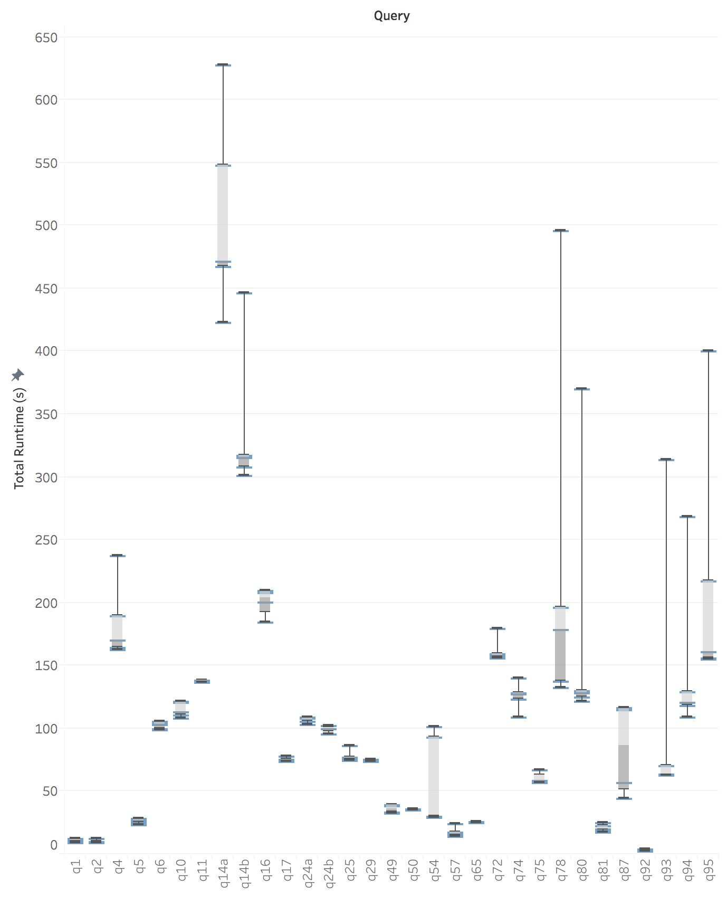
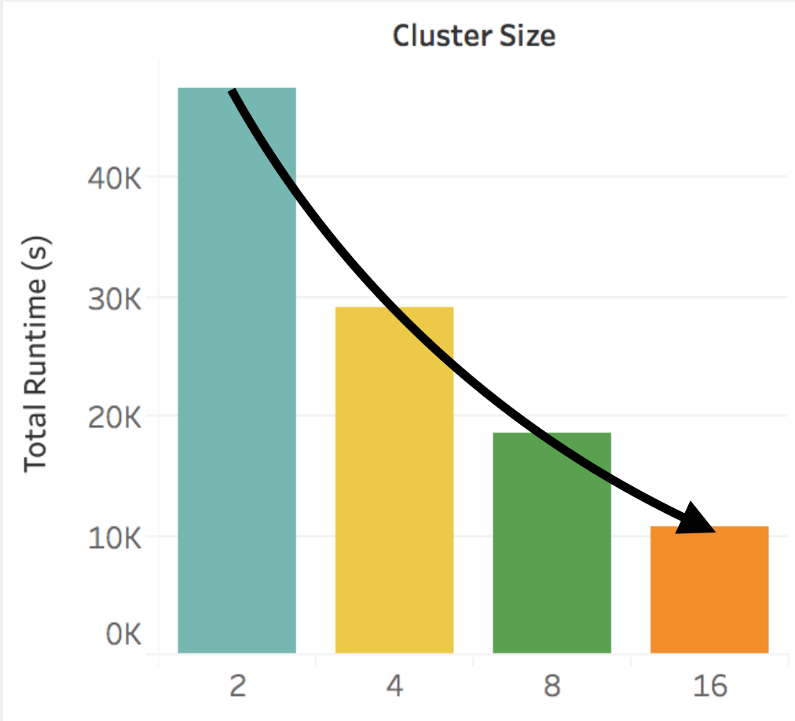
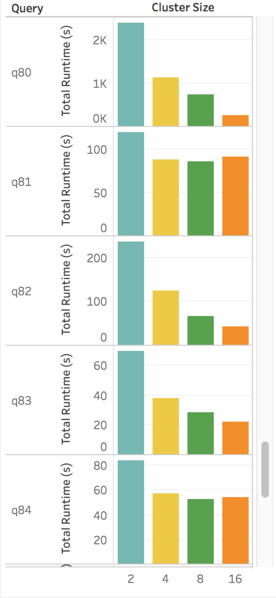
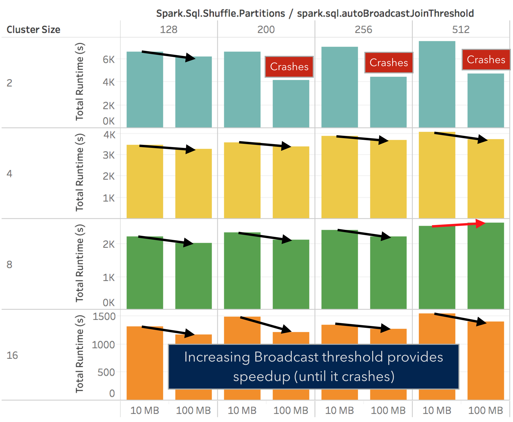
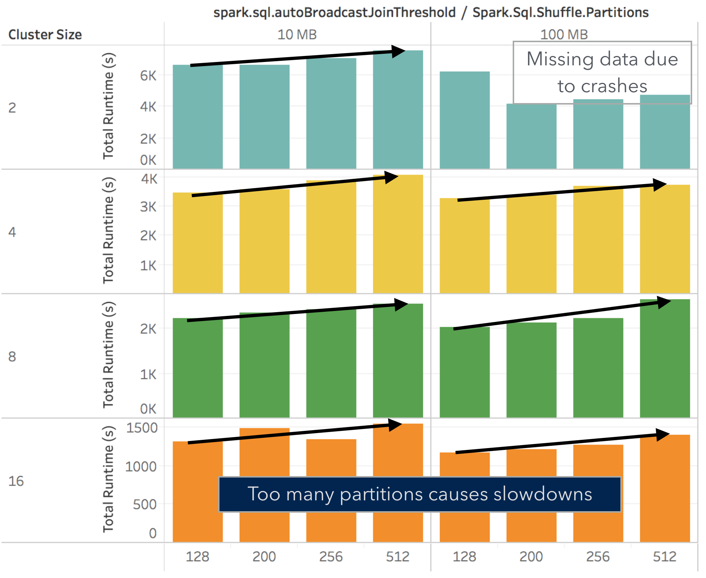
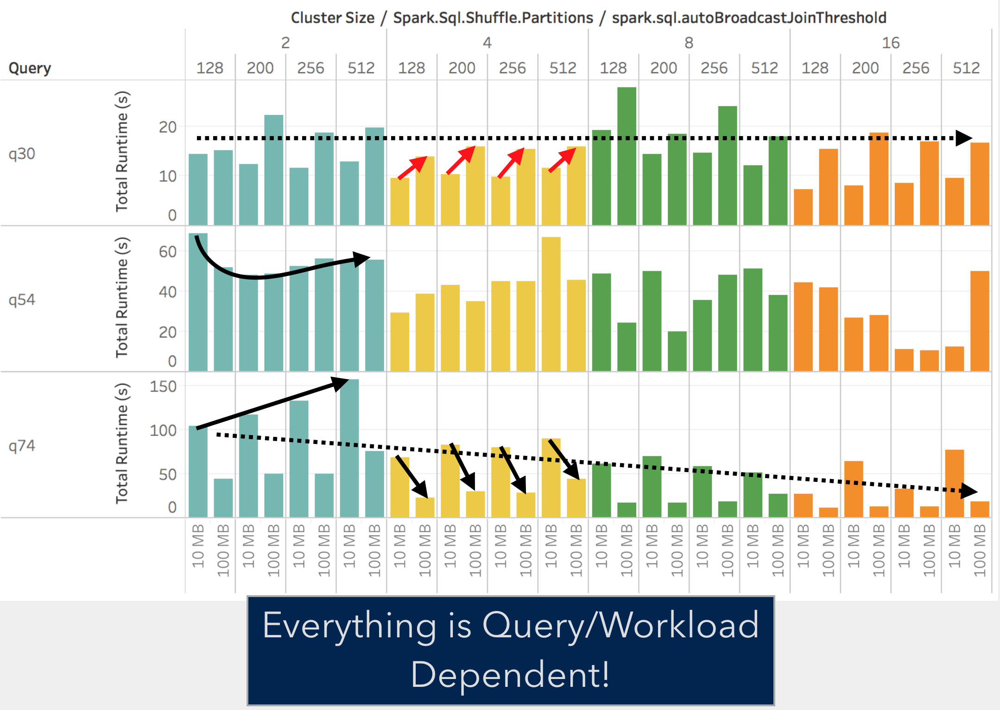

# CSE 599c Class Project: How I spent 500 CPU-hours running TPC-DS on Apache Spark
By Tomer

## Intro
With dozens of configuration parameters in [Apache Spark](https://spark.apache.org)), it can be hard for users to know what configuration changes are worthwhile to try when tuning their own workloads. Identifying good default settings would be very useful, as would finding rules of thumb for how to set the parameters. So, I chose to exhaustively explore as much of the configuration space of Spark SQL as possible without using too many EC2 credits, by running the [TPC-DS benchmark](http://www.tpc.org/tpcds/) with different Spark SQL configurations.

The Spark clusters used in my experiments spent over 30 hours of runtime (almost 600 CPU-hours) exploring over 2300 points in the (query, configuration parameter, cluster size) design space, 1500 of which ran to completion. The major findings were as follows: Spark seems to scale for most TPC-DS queries, with the effectiveness of scaling depending on the query; using too many partitions when shuffling adds overhead; the threshold for automatically broadcasting tables is set too conservatively for many queries; and the optimal choice of configurations vary widely depending on the queries and workloads being run.

While the findings about the individual parameters are fairly underwhelming, the process of exploring the configuration space provided useful insights about the problem of tuning systems in the real world.

## Configuring Apache Spark
[Apache Spark](https://spark.apache.org) is a cluster-based data flow execution engine that has become increasingly popular in recent years. Like any large system, configuring Spark can be a challenge. Spark has dozens of [configuration parameters](https://spark.apache.org/docs/latest/configuration.html), ranging from parameters that control memory allocation to settings that affect scheduling and data compression. When running Spark on AWS there are also many hardware decisions to make, such as instance type and cluster size. Spark SQL, the SQL query execution layer built on top of Apache Spark, adds even more [ parameters](https://jaceklaskowski.gitbooks.io/mastering-apache-spark/content/spark-sql-SQLConf.html), such as whether or not to use code generation when compiling SQL queries, and whether to prefer hash joins or sort merge joins.

## Experimental Setup

To explore Spark SQL's configuration space, I chose to take 48 [TPC-DS](http://www.tpc.org/tpcds/) benchmark queries I got running for another project (these are the only TPC-DS queries for which Spark SQL supports both sort merge joins and hash joins), and to do a grid search of a subset of the global design space. To limit the space I explored to a manageable size, I chose to focus on three configuration properties I expected to have a large impact on TPC-DS: the number of nodes in a cluster, the number of partitions to use when shuffling, and the maximum table size at which Spark SQL will automatically decide to use broadcast joins.

So, I ended up with the following design space with 2300 options to explore:
- TPC-DS scale factor of 100 (corresponding to 100 GB)
- 48 TPC-DS queries
- 4 clusters of r3.xlarge nodes on EC2: 2, 4, 8, 16 nodes
- 4 shuffle partition counts: 128, 200 (default), 256, 512
- 3 automatic broadcasting thresholds: 10 mb (default), 100 mb, 1000 mb

(Note: The seemingly out of place shuffle partition count of 200 was included because that is Spark's default setting.)

However, the largest automatic broadcasting size (1000 mb) led to crashes across the board due to running out of disk space when copying, and due to overwhelming the network and causing timeouts. So, the final explored design space only used 10 mb and 100 mb as the parameter values, with a total of over 1500 points.

So as to avoid excessive resource usage, I chose to only use one trial for each point in the space. While this might be okay for finding overall patterns among the parameters, it is problematic when trying to identify the causes of individual anomalies. The following graph shows some of the very high variances in TPC-DS query runtimes I have observed in other projects (running with 8 nodes, 256 partitions, 10 mb broadcasts):

Additionally, the benchmarking harness I used lacked instrumentation. This also made it harder to track down the causes of anomalous runtimes.

## Evaluation
The full results of our experiments can be found in a [local packaged tableau workbook](data/tpcds-599c-tableau.twbx)

### Scaling
In our experiments, we observed that Spark does indeed manage to scale for the TPC-DS queries (at least with our tested cluster sizes), with an approximate 4.5x speedup when using 16 nodes as opposed to 2 nodes. Although this is not perfectly linear scaling, it is nontrivial given many operations in the queries are not perfectly parallel.

When we look at individual queries, we observe that scaling varies drastically between queries. As a concrete example using the following graph, q80 scales near-perfectly whereas q81 actually experiences a slowdown when going from 8 nodes to 16.

It was not self-evident why some queries scale better than others from the query plan. Many TPC-DS queries include multiple joins of different sizes, but it is likely that the queries with poorer scaling properties have higher partition skew and involve more data shuffling. Unfortunately, the lack of complete instrumentation in the benchmarking suite made it challenging to confirm this hypothesis.

### Auto-broadcast Threshold

The TPC-DS benchmark queries involve many joins of very small tables with very large ones. So, it was to be expected that increasing the threshold for automatically using broadcast joins (in cases where Spark SQL has statistics about the sizes of tables) would have an impact on the benchmark queries. Increasing the threshold unfortunately caused crashes in some two-node cases when using many partitions. The two machines were low on disk space from storing the TPC-DS data alone, let alone when storing multiple copies of additional tables. Likewise as mentioned earlier, when the threshold was set to 1000 MB network errors began to cause crashes as well as disk space errors.

However, it does appear that in many TPC-DS queries Spark SQL's default setting of 10 MB is overly conservative, and that if a workload involves joins with small tables it may be worthwhile to increase the automatic broadcasting threshold and to manually provide broadcasting hints for cases where Spark's cardinality estimation is insufficient.

### Partition Count

The largest tested cluster had a total of 64 virtual CPUs, so even with the smallest tested partition count of 128 there were at least 2 partitions per core. The results on TPC-DS suggest that using excessive numbers of partitions when shuffling does indeed add overhead. This overhead is likely to come both from a higher scheduling overhead from having to schedule more partitions, and from lowered efficiency in per-partition operators when processing smaller partitions. For example, sorting two partitions of length `x` is likely to require more work than shuffling a single partition of length `2x`, as sorting is an `n log n` operation.

Although these specific results show that too many partitions can be a bad thing, it can also be bad to have too few partitions (a scenario not tested here). If there are fewer partitions than cores, resources in the cluster could be insufficiently utilized. Additionally, if there are stragglers in the cluster or there is skew in the processing time of the partitions, having too few partitions could impede Spark's ability to balance work across the cluster.

### Per-Query Variance
While the previous sections demonstrated mild but consistent patterns throughout the  TPC-DS benchmark in aggregate, the impact on individual queries was much larger and varied across queries. In fact, for some queries the observed patterns reversed entirely.

For example, in q30 scaling the size of the cluster did not speed up queries, and increasing the automatic broadcast threshold actually slowed down the query instead of speeding it up. It is possible that this is because q30 is a much lower latency query, and spends relatively more of it's time in operations that occur solely on the driver, such as preparing tables to be broadcasted and shuffled during query execution.

The differences in performance between queries suggest that the details of our findings do not necessarily generalize, and are very dependent on the exact workloads being run.

## Takeaways
Due to the expansive parameter spaces of systems such as Apache Spark and the lack of performance generalization, finding good configuration defaults for a system to use is a very challenging problem. While cost models may help, it is likely prohibitive to build them for the entire configuration space.

So, rather than being tuned in a vacuum, parameters need to be configured for the real workloads being run on live systems. Full grid searches are going to be impractical, necessitating other approaches such as naive random searches or using machine learning techniques in effective ways. Additionally, the exploration strategies used must take into account the observed variances in runtime (which can be very large). Finally, if there is the possibility of using different parameters for different queries there is room for much larger performance gains, as even queries within the same workload can react to system configurations in drastically different ways.
